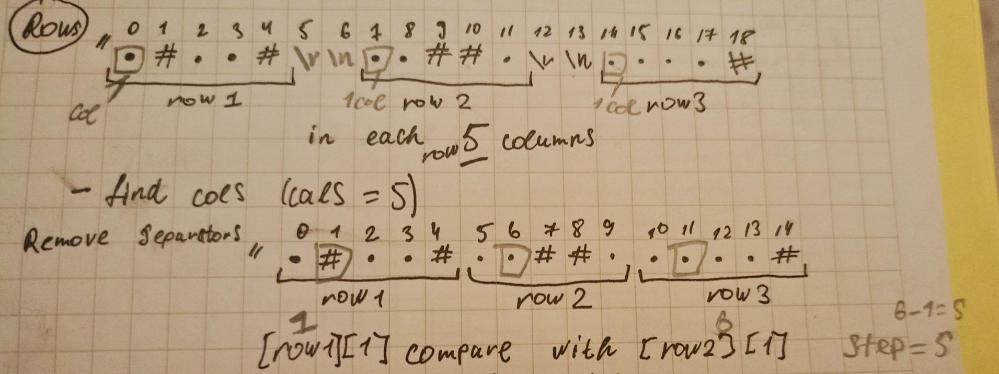

- First solution: Matrix
  - Time complexity: O(2L + M * N * N), where N is rows, M is columns, L - length of string
  - Space complexity: O(3L), where L is length of input string

- Second solution: ColumnsCountStep - CharArray
  - Time complexity: O(M + L * L / M), where M is columns, L - length of string
  - Space complexity: O(L) = 4222, where L is length of input string

- Third solution: ColumnsCountStep - StringBuilder
  (Same to second)

**Conclusion:**
Solution with conversion to a char array is the most efficient in speed and the same in memory as StringBuilder
The matrix is the least efficient in both speed and memory.

Explanation 2th and 3thd solutions:

